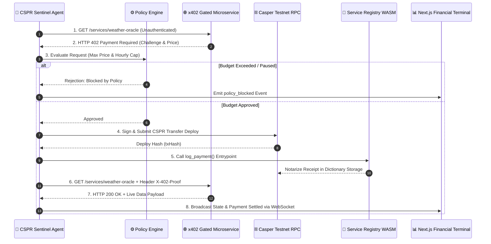

# CSPR Sentinel 🛡️
> **Autonomous AI Agent for Microservice Discovery, x402 Micropayments, and On-Chain Notarization on Casper Network**

[](https://casper.network)
[](https://x402.org)
[](./contract)
[](./LICENSE)

---

## 📌 Executive Summary

**CSPR Sentinel** is a fully autonomous AI agent runtime operating on the **Casper Network Testnet**. Unlike simple chatbot wrappers around LLMs, CSPR Sentinel holds its own hot-wallet Ed25519 keypair, discovers paid microservices, evaluates HTTP 402 "Payment Required" challenges against a strict budget policy engine, executes real on-chain CSPR transfers, and notarizes immutable transaction receipts directly into a custom Rust/Wasm Casper smart contract.

---

## 🏛️ System Architecture



---

## 🚀 Quick Start (One Command)

### Prerequisites
- **Node.js**: v18.x or v20.x or v22.x
- **npm** or **pnpm**
- **Rust toolchain** (optional, pre-built WASM binary included in `contract/target/wasm32-unknown-unknown/release/cspr_sentinel_contract.wasm`)

### 1. Installation & Monorepo Setup
```bash
git clone https://github.com/your-username/cspr-sentinel.git
cd cspr-sentinel
npm install
```

### 2. Launch Local Demo (Agent + Financial Terminal UI)
```bash
npm run dev
```
- **Financial Terminal Dashboard**: `http://localhost:3000`
- **Agent REST & WebSocket API**: `http://localhost:3001` (ws://localhost:3001)

---

## 📜 Smart Contract Specification (`/contract`)

The smart contract is written in **Rust**, compiled to `wasm32-unknown-unknown`, and deployed to the Casper Testnet.

### Key Entry Points
1. `register_service(service_id: String, price_motes: String, endpoint_hash: String)`:
   Owner-only entry point registering payable service endpoints into contract storage.
2. `log_payment(service_id: String, payer: String, amount: String, receipt_hash: String, timestamp: u64)`:
   Public entry point executed post-payment. Appends immutable receipt entries into `records` dictionary storage under `payment_{index}` and `{payer}_{count}` keys.

### Deploy & Gas Metrics
- **WASM Size**: 48 KB (Optimized release profile)
- **Deployment Cost**: 150 CSPR (`150,000,000,000 motes`)
- **Invocation Gas Cost**: 2.5 CSPR (`2,500,000,000 motes`)
- **Testnet Network Name**: `casper-test`

---

## 🎯 How This Project Meets All Hackathon Requirements

| Hackathon Requirement (§0 & §6) | Satisfied In Codebase | Implementation Details & Proof |
| :--- | :--- | :--- |
| **Autonomous AI Transactor** | `agent/src/agent.ts` | Holds keypair, discovers endpoints, evaluates budget, signs CSPR deploys autonomously without human intervention. |
| **Casper Testnet Execution** | `agent/src/casper.ts` | Connects directly to Casper Testnet RPC (`casper-test`) via `casper-js-sdk`. |
| **x402 Protocol Implementation** | `shared/src/x402.ts`, `agent/src/services.ts` | Full HTTP 402 challenge/response protocol with base64 encoded payment proof headers. |
| **Rust WASM Smart Contract** | `contract/src/main.rs` | Real `#![no_std]` Rust contract compiled to WASM; notarizes receipts into dictionary storage. |
| **Budget Policy Boundaries** | `agent/src/policy.ts`, `frontend/components/BudgetPanel.tsx` | Enforces max single request price limit & hourly spend cap with interactive slider controls. |
| **Financial Terminal UI** | `frontend/` | Next.js 14 dashboard with live SVG flow animation, count-up balance, dark/light theme, and direct contract proof panel. |
| **One-Command Setup** | `package.json` | `npm run dev` launches agent worker and Next.js frontend concurrently. |
| **Demo Recording Script** | `DEMO_SCRIPT.md` | Comprehensive 2–3 minute video presentation script. |
| **Open-Source License** | `LICENSE` | MIT Licensed, `.env.example` present, zero private keys committed. |

---

## 🛠️ Repository Monorepo Structure

```
cspr-sentinel/
├── contract/                    # Rust WASM Smart Contract (Casper Testnet)
│   ├── src/main.rs              # Contract entry points (register_service, log_payment)
│   ├── scripts/deploy.ts        # Contract deployment script
│   └── Cargo.toml               # casper-contract v3.0.0 dependency
├── shared/                      # Shared Types, Config & x402 Helpers
│   ├── src/types.ts             # Agent, Payment, Policy & WebSocket Event schemas
│   ├── src/config.ts            # Network config & 4 mock service definitions
│   └── src/x402.ts              # x402 Challenge & Proof parser
├── agent/                       # Agent Runtime & Mock Service Server (Node.js/TS)
│   ├── src/casper.ts            # Keypair manager & Casper SDK engine
│   ├── src/policy.ts            # Budget policy engine
│   ├── src/services.ts          # 4 Mock x402 Gated Microservices
│   ├── src/agent.ts             # Autonomous loop & event emitter
│   └── src/index.ts             # REST API & WebSocket server
├── frontend/                    # Next.js 14 Financial Dashboard
│   ├── app/page.tsx             # Main dashboard page
│   └── components/              # Header, WalletCard, PaymentFlow, BudgetPanel, ServicesGrid, OnChainProof
├── DEMO_SCRIPT.md               # 2-3 min video submission script
├── README.md                    # System documentation
└── package.json                 # Monorepo root script runner
```

---

## 📄 License
This project is open-source under the [MIT License](./LICENSE).
